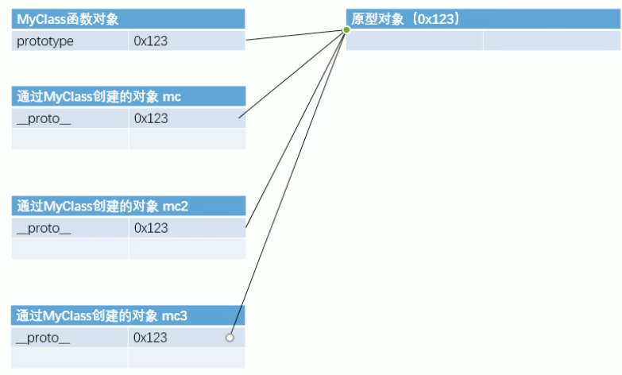
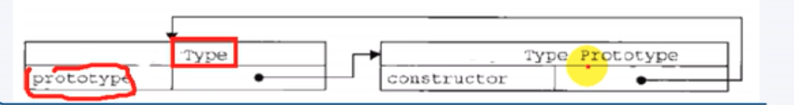
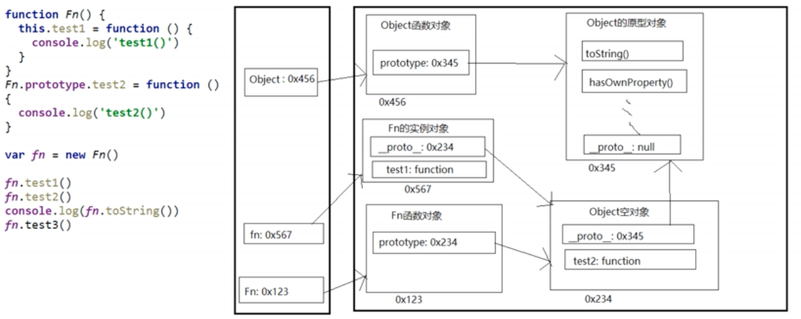

#  JavaScript

## 引入

```html
<script src="">

</script>
```

script标签一旦引入外部文件，就不能在

内部代码需要重新创建新的script标签

## 基本语法

1.JS中严格区分大小写

2.JS中每一条语句以分号(;)结尾 

如果不写分号，浏览器会自动添加，但是会消耗- -些系统资源，而且有些时候，浏览器会加错分号，所以在开发中分号必须写

3.JS中会忽略多个空格和换行，所以我们可以利用空格和换行对代码进行格式化

## 与html

### 直接写入输出流

```js
document.write("<h1>这是一个标题</h1>");
document.write("<p>这是一个段落。</p>");
```

您只能在 HTML 输出中使用 document.write。如果您在文档加载后使用该方法，会覆盖整个文档。


### 对事件的反应

弹出提示

```js
<button type="button" onclick="alert('欢迎!')">点我!</button>
```

alert()函数在js中并不常用，一般用于测试代码


### 改变html内容

```js
<p id="demo">
JavaScript 能改变 HTML 元素的内容。
</p>

x=document.getElementById("demo");  //查找元素
x.innerHTML="Hello JavaScript";    //改变内容
```


### 改变 HTML 图像

例：使电灯泡点击切换

```html
<script>
	function changeImage(){
		img=document.getElementById("light")
		if(img.src.match("bulbon"))   
		{
			img.src="media/pic_bulboff.gif";
		}
		else
		{ 
			img.src="media/pic_bulbon.gif";
		}
	}
</script>


```

` **element.src.match("bulbon")** `*的作用意思是：检索* `` *里面 src 属性的值有没有包含* **bulbon** *这个字符串，如果存在字符串* **bulbon***，图片* **src** *更新为* **bulboff.gif***，若匹配不到* **bulbon** *字符串，***src** *则更新为* **bulbon.gif**


### 改变HTML样式

```js
x=document.getElementById("demo")  //找到元素 
x.style.color="#ff0000";           //改变样式
```


### 验证输入

```js
function myFunction()
{
	var x=document.getElementById("demo").value;
	if(x==""||isNaN(x))
	{
		alert("不是数字");
	}
}
```

如果要在生产环境中使用，需要严格判断，如果输入的空格，或者连续空格 isNaN 是判别不出来的。

可以添加正则来判断(后续章节会说明)：

```js
if(isNaN(x)||x.replace(/(^\s*)|(\s*$)/g,"")=="")
{
		alert("不是数字");
}
```


### 输入

​	**采用prompt函数进行对话框输入**

​	**输入类型为string**

不可直接进行数据处理


在prompt前加+，可将其转换为number

```js
var	 a = +prompt("请输入a")
```


### 输出

#### 1.JavaScript 可以通过不同的方式来输出数据：

- 使用 **window.alert()** 弹出警告框。
- 使用 **document.write()** 方法将内容写到 HTML 文档中。
- 使用 **innerHTML** 获取 HTML 元素内部代码。
- 使用 **console.log()** 写入到浏览器的控制台。


#### 2.操作HTML元素

如需从 JavaScript 访问某个 HTML 元素，您可以使用 document.getElementById(*id*) 方法

使用id属性来标记html元素

innerHTML =“·······”；来获取或插入元素内容

对于自结束标签，这个属性没有意义


```js
id = document.getElementById("btn1")
//通过id属性获取一个节点对象
tagname = ç
//通过标签名获取一组元素节点对象,封装到类数组中返回
name = document.getElementByName("")
//通过name属性获取一组元素节点对象
```

想读取元素节点属性，直接使用`元素.属性名`

例如

```js
alert(name[i].age)
```

但是class属性时需要使用`元素.className`

##### 获取元素节点的子节点

1. getElementByName

    * 方法。只在当前city下找

    ```js
    var city = document.getElementById("city");
    var lis = city.getElementByName("li");
    ```

2. childNodes

    * 属性，当前节点的所有子界节点

        会获取包括文本节点的所有节点，包括换行等

3. firstNodes

    * 属性，当前节点的第一个子节点

4. lastNodes

    * 属性，当前节点的最后一个子节点

##### 获取父节点和兄弟节点

1. parentNode 

    * 属性，表示当前节点的父节点

2. previousSibling

    * 属性，表示当前节点的前一个兄弟节点

3. nextSilling

    * 属性，表示当前节点的后一个兄弟节点

        

    


#### 3.写到html文档

```js
document.write(Date());
```

**注意：document.write()仅仅向文档输出写内容，如果在文档已完成加载后执行 document.write，整个 HTML 页面将被覆盖。**


#### 4.写到控制台

```
console.log();
```

即可在控制台看到输出内容

计算运行时间

```javascript
console.time("计时器名称")

console.timeEnd("计时器名称")

```


## 语法

### 字面量

#### 1.数字/字符串

字符串也可以是对象：

```js
var x = "jayce";
var y = new String ("jayce")
```

其中x是字符串

y是对象

`(x === y) // 结果为 false`


可使用单引号和双引号

 用`''`或`""`表示

如果`'`本身也是一个字符，那就可以用`""`括起来

如果字符串内部既包含`'`又包含`"`，使用转义字符`\`来表示

在`'`前面加上\，即可将其显示

\后还可以使用Unicode编码


##### 多行字符串

使用`\n`比较费事，使用` `` `来包含。


##### 模板字符串

把多个字符串连接起来使用`+`

也可以使用`${变量名}`来代替


##### 操作字符串

1.取长度

```js
var s = 'Hello, world!';
s.length; // 13
```

获取字符串指定位置的字符

```javascript
var s = 'Hello, world!';

s[0]; // 'H'
s[6]; // ' '
s[13]; // undefined
//////////
var res = s.charAt(0);
//res = "H"
```

 **超出范围的索引不会报错，但一律返回undefined**

###### charAt()

根据索引获取指定的字符

##### charCodeAt()

根据索引获取指定字符的Unicode


### replace()

```js
result = str.replace("a","aaad")
```

可以加正则表达式


JS中可以表示的数字最大值是：`Number.MAX-VALUE`

再大就是正无穷`infinity`

大于0的最小值`Number.MIN-VALUE`


**特别注意：**

字符串是不可变的，如果对字符串的某个索引赋值，不会有错，但也没用


##### 特别方法：

**null和undefined调用会报错**

###### toUpperCase

`toUpperCase()`把一个字符串全部变为大写：

```js
var s = 'Hello';
s.toUpperCase(); // 返回'HELLO'
```

###### toLowerCase

`toLowerCase()`把一个字符串全部变为小写：

```js
var s = 'Hello';
var lower = s.toLowerCase(); // 返回'hello'并赋值给变量lower
lower; // 'hello'
```

###### indexOf

`indexOf()`会搜索指定字符串出现的位置：

可以添加第二个参数，指定开始查找的位置

```js
var s = 'hello, world';
s.indexOf('world'); // 返回7
s.indexOf('World'); // 没有找到指定的子串，返回-1
```

###### lastIndexOf

`lastIndexOf`会反向搜索

###### substring

`substring()`返回指定索引区间的子串：

```js
var s = 'hello, world'
s.substring(0, 5); // 从索引0开始到5(不包括5)，返回'hello'
s.substring(7); // 从索引7开始到结束，返回'world'
```


#### 字符串转数字

`Number()` 常规转换

**`parseInt()`将字符串的有效数字取出来。**从首位开始

`parseFloat`可获得有效小数

如果对非string进行上两个操作，会先转为string在进行提取


### 数组(array)

[40, 100, 1, 5, 25, 10]

数组是一种特殊的**对象格式**，所以`typeof [1,2,3,4] 返回 object`

array可以包含**任意数据类型**，并通过索引来访问每个元素

要取得`Array`的长度，直接访问`length`属性：

```js
var arr = [1, 2, 3.14, 'Hello', null, true];
arr.length; // 6
```

对于非连续的数组，length会得到最大索引+1


但如果给`length`赋一个新的值会导致`array`大小发生变化

若大于之前的值，则多余的为`undefined`

若小于之前的值，则按顺序取，其余丢弃

若使用索引给数组赋值，索引超出了范围，则自动改变大小，没有值的`undefined`

#### 特别方法：

##### indexOf

与字符串相同用法，搜索指定元素的位置

```js
var arr = [10, 20, '30', 'xyz'];
arr.indexOf(10); // 元素10的索引为0
arr.indexOf(20); // 元素20的索引为1
arr.indexOf(30); // 元素30没有找到，返回-1
arr.indexOf('30'); // 元素'30'的索引为2
```

##### slice

截取`Array`的部分元素

```js
var arr = ['A','B','C','D','E','F','G'];
arr.slice(0, 3); // 从0开始，3结束，但不包括索引3: ['A','B','C']
arr.slice(3); // 从3开始到结束: ['D','E','F','G']
```

若不传递任何参数，则全部截取，可用作复制操作

##### push和pop

`push()`向`Array`的末尾添加若干元素；

`pop()`则把`Array`的最后一个元素删除掉；

```js
var arr = [1, 2];
arr.push('A','B');  //返回Array新的长度:4
arr;     // [1,2,'A','B']
arr.pop(); // pop()返回'B'
arr; // [1,2,'A']
arr.pop(); arr.pop(); arr.pop(); //连续pop 3次
arr; //[]
arr.pop(); 
arr; //[]
```

空数组继续pop不会报错，而是返回undefined

##### unshift和shift

与push和pop相反的是unshift和shift

unshift向数组的头部添加元素

shift则把数组的第一个元素删掉

```js
var arr = [1, 2];
arr.unshift('A', 'B'); // 返回Array新的长度: 4
arr; // ['A', 'B', 1, 2]

arr.shift(); //删除'A'
arr; // ['B', 1, 2]
arr.shift(); arr.shift(); arr.shift(); // 连续shift 3次
arr; // []
arr.shift(); // 空数组继续shift不会报错，而是返回undefined
arr; // []
```

##### forEach

IE8以下不支持

遍历数组

数组中有几个元素函数就会执行几次，每次执行时，浏览器会将遍历到的元素以实参的形式传递进来，我们可以来定义形参，来读取这些内容

浏览器会在回调函数传递三个参数

1. 正在遍历的元素
2. 遍历元素的索引
3. 正在遍历的数组

```js
var arr = [1,2,3,4,5];
arr.forEach(function (value,index,obj){
  
})
```

##### some

##### filter

##### findIndex


##### sort

`sort()`可以对当前`Array`进行排序，它会直接修改当前`Array`的元素位置

```js
var arr = ['B', 'C', 'A'];
arr.sort();
arr; //['A', 'B', 'C']
```

默认按照Unicode，对数字排序会得到错误结果

必须自己指定排序规程

在sort中添加回调函数

浏览器会根据返回值来决定元素顺序

​	如果返回一个大于0的，元素会交换

​	如果返回一个小于0的值，则元素位置不变

​	如果返回一个0，则认为两个元素相等，也不交换位置

```js
arr.sort(function(a,b){
//前边的大
//     if(a > b){
//         return 1;
//     }else if(a < b){
//         return - 1;
//     }else{
//         return 0;
//     }
    //简写
    return a-b;
});
```


##### reverse

`reverse()`把整个`Array`的元素给调个个，也就是反转

```js
var arr = ['one', 'two', 'three'];
arr.reverse(); 
arr; // ['three', 'two', 'one']
```


###### slice

用来提取指定元素（切片）

```js
arr.slice(start,end)
```

 包含开始，不包含结束

负值从后往前


##### splice

`splice()`方法是修改`Array`的“万能方法”，它可以从指定的索引开始删除若干元素，然后再从该位置添加若干元素：

```js
arr.splice(start[, deleteCount[, item1[, item2[, ...]]]])
```


```js
var arr = ['Microsoft','Apple','Yahoo','AOL','Excite','Oracle'];
// 从索引2开始删除3个元素,然后再添加两个元素:
arr.splice(2,3,'Google','Facebook');
//返回删除的元素 ['Yahoo','AOL', 'Excite']
arr; 
// ['Microsoft', 'Apple', 'Google', 'Facebook', 'Oracle']
// 只删除,不添加:
arr.splice(2, 2); 
// ['Google', 'Facebook']
arr; 
// ['Microsoft', 'Apple', 'Oracle']
// 只添加,不删除:
arr.splice(2, 0, 'Google', 'Facebook'); 
// 返回[],因为没有删除任何元素
arr; 
// ['Microsoft', 'Apple', 'Google', 'Facebook', 'Oracle']
```

##### concat

`concat()`方法把当前的`Array`和另一个`Array`连接起来，并返回一个新的`Array`：

```js
var arr = ['A','B','C'];
var added = arr.concat([1, 2, 3]);
added; //['A','B','C',1,2,3]
arr; //['A','B','C']
```

*请注意*，`concat()`方法并没有修改当前`Array`，而是返回了一个新的`Array`。

实际上，`concat()`方法可以接收任意个元素和`Array`，并且自动把`Array`拆开，然后全部添加到新的`Array`里：

```js
var arr = ['A', 'B', 'C'];
arr.concat(1, 2, [3, 4]); // ['A', 'B', 'C', 1, 2, 3, 4]
```

##### join

`join()`合并数组。

它把当前`Array`的每个元素都用指定的字符串连接起来，然后返回连接后的字符串：

```js
var arr = ['A', 'B', 'C', 1, 2, 3];
arr.join('-'); // 'A-B-C-1-2-3'
```


##### instanceof

可以检查一个对象是否是一个类的实例

语法：

​	对象   instanceof   构造函数

是则返回true


### Math库

与python等类似

#### abs绝对值

#### ceil向上取整

1.1 ---2

1---1

#### floor向下取整

去除小数点后

#### round四舍五入

#### random随机数

随机产生0-1的数


### 包装类

是临时将基本数据类型转换为对象

**注意⚠️**：最好不要使用基本数据类型的对象。

比如number比较，会比较地址，而不是数据大小

boolean：所有对象转换为boolean都是true

方法和属性之能添加给对象，不能添加给基本数据类型

当我们对一些基本数据类型的值去调用属性和方法时，

浏览器会临时使用包装类将其转换为对象，然后在调用对象的属性和方法

调用完以后，在将其转换为基本数据类型


String()

Number()

Boolean()


### 对象(object)

除了五种数据类型之外，其余全是对象

​	string 、number、boolean、null、undefined未定义


新建对象

```js
var obj = new Object();
obj.name = "Jayce"
```


```js
var xiaoming = {
    name: '小明',
    birth: 1990,
    school: 'No.1 Middle School',
    height: 1.70,
    weight: 65,
    score: null
};
```

1. 每一条键值对用`,`隔开。

2. 最后一对不需要加`,`

3. 访问属性使用`.`操作。

4. 当属性名有特殊符号时，需要使用`"..."`

    

    **当属性名由未被规定的符号时，需采用以下方式：**
```js
var xiaohong = {
	name: '小红',
    "middle-school": 'No.1 Middle School'
};
xiaohong["middle-school"]
```


并且访问的时候，只能使用`对象['属性名'];`

当访问一个不存在的属性不会报错，而是会返回`undefined`


#### 添加和删除

添加：直接赋值

删除：使用delete

#### 查找

判断是否拥有某一属性：用`in`操作符

```js
'name' in xiaoming; // true
'grade' in xiaoming; // false
```

但如果存在，也有可能是继承得到的


### 变量

使用var来定义变量

```js
var x, length
x = 5
length = 6
```

变量是一个可变的，而字面量是一个恒定的

变量类型：

1. 数字

2. 字符串

3. 数组

4. 对象

   对象由花括号分隔。在括号内部，对象的属性以名称和值对的形式 (name : value) 来定义

   由`,`来分割

   对象有两种寻址方式：

   ```js
   name=person.lastname;
   name=person["lastname"];
   ```

   
### Undefined 和 Null

   Undefined 这个值表示变量不含有值。

   Null表示空对象，或者说值为Null

   可以通过将变量的值设置为 null 来清空变量


  


```js
var length = 16;                                  // Number 通过数字字面量赋值
var points = x * 10;                              // Number 通过表达式字面量赋值
var lastName = "Johnson";                         // String 通过字符串字面量赋值
var cars = ["Saab", "Volvo", "BMW"];              // Array  通过数组字面量赋值
var person = {firstName:"John", lastName:"Doe"};  // Object 通过对象字面量赋值
```
- 变量必须以字母开头

- 变量也能以 $ 和 _ 符号开头(不过我们不推荐这么做)

- 变量名称对大小写敏感(y 和 Y 是不同的变量)

用 `var` 操作符定义的变量将成为定义该变量的作用域中的局部变量。也就是说，如果在函数中使用 `var` 定义一个变量，那么这个变量在函数退出后就会被销毁


### 作用域

​	每一个变量的作用范围

* 全局作用域

    * 直接在script标签的JS代码，都在全局作用域

    * 全局作用域在页面打开时创建，页面关闭时销毁

    * 全局作用域有一个全局对象window，代表浏览器窗口

        * **创建的变量都会作为window对象的属性保存**

        * **创建的函数都会作为window对象的方法保存**

             

* 函数作用域

    * 调用函数时创建函数作用域
    * 函数执行完毕，函数作用域销毁
    * 作用域之间互相独立
    * 函数作用域可以访问到全局作用域


#### **基本数据类型和引用数据类型的区别**

基本数据类型（五种）不随原变量来改变

JS 的变量都是保存在栈内存中的

​	基本数据类型的值直接保存在栈内存

​		值与值之间 独立存在，修改一个变量不会影响到其他变量

​	对象时保存在堆内存的

​		但对象在栈内存中，obj的值是堆内存的地址

​		如果两个变量保存的是同一个对象引用，改变其中一个，另一个也会改变

​		


​	


### 等于号

`=`表示赋值

`==`自动转换数据类型比较

`===`不转换数据类型比较

**不要使用==，要始终使用===比较**


#### 关于NaN

not a number

`NaN`这个特殊的Number与所有其他值都不相等，包括它自己

唯一能判断`NaN`的方法是通过`isNaN()`函数：

```js
isNaN(NaN);    //true
```


### 关于浮点数

```js
1 / 3 === (1 - 2 / 3); // false
```

浮点数在运算过程中会产生误差，因为计算机无法精确表示无限循环小数。

**不要用JS算钱**

0.1+0.2！= 0.3

要比较两个浮点数是否相等，只能计算它们之差的绝对值，看是否小于某个阈值：

```js
Math.abs(1 / 3 - (1 - 2 / 3)) < 0.0000001;          // true
```


### 判断数据类型

#### typeof

可以判断：

* undefined
* 数值
* 字符串
* 布尔值
* function

不能判断：

* null与object
* object与array


#### instanceof

判断对象的具体类型

```js
obj instanceof Object;
obj instanceof Array;
```


#### ===

可以判断：

* undefined 

* null


### 进制

0x 十六进制

0 八进制

0b 二进制

但输出会会转化为十进制


### 自增/减

a++ 后++

++a 前++

区别是a++和++a值不同

a++输出是a，自增前的值

++a输出是a+1 ，新值


### 逻辑运算

#### 与运算

​	两个值都为true，返回后边的

​	如果有false，返回前面的false

​	

#### 或运算

​	第一个为true，直接返回第一个

​	第一个为false，直接返回第二个

​	

#### 条件运算

​	`表达式？语句1:语句2`

表达式为true执行语句1，否则执行2

```js
var max = a > b ? a : b
```


## 语句

JS向浏览器发出命令语句用`；`来分割

### 1.js关键字

var：创建新的变量

### 2.分号的用法

分号用于分隔 JavaScript 语句。

通常我们在每条可执行的语句结尾添加分号。

使用分号的另一用处是在一行中编写多条语句。

**在 JavaScript 中，用分号来结束语句是可选的**


### 3.折行

在文本字符串中使用反斜杠代码进行换行。

```js
document.write("你好 \
世界!");
```

### 4.注释

单行注释使用`//`

多行注释使用`/*.........*/`

同c语言

**ps**：验证浏览器是否支持JS

```js
<script>
<!--
document.write("您的浏览器支持JavaScript脚本!");
//-->
</script>
```

### for

同c++

可以对for加一个label来标示当前循环


### break

break可以结束离他最近的循环，且不对外层循环有影响

**label表示结束循环**

```javascript
label：
	for(){
		for(){
			break label;
		}
	}
```

​	其中label可以更换名字

### continue

continue可以跳过当次循环

默认只会对他最近的循环起作用


### use strict模式(严格模式)

在strict模式下运行的JavaScript代码，强制通过`var`申明变量，未使用`var`申明变量就使用的，将导致运行错误。

启用strict模式的方法是在JavaScript代码的第一行写上：

```js
'use strict';
```

严格模式的限制：

1. 不允许使用未声明的变量

2. 不允许删除变量和对象

3. 不允许删除函数

4. 不允许变量重名

5. 不允许使用八进制

6. 不允许使用转义字符

7. 不允许对只读属性赋值

8. 不允许对一个使用getter方法读取的属性进行赋值

9. 不允许删除一个不允许删除的属性

10. 变量名不能使用eval

11. 变量名不能使用arguments

12. 作用域 eval() 创建的变量不能被调用

13. 禁止this关键字指向全局对象

    

## 函数

变量和参数必须以一致的顺序出现。第一个变量就是第一个被传递的参数的给定的值，以此类推。

实参可以是任何数据类型

​	可以将多个数据封装到一个对象中

实参也可以是一个函数


#### 带有返回值的参数

通过return将值返回调用的地方


#### 局部JavaScript变量

函数内部使用`var`定义的变量是局部变量，只能在函数内部使用。

可以在不同的函数中使用相同的变量名

#### 全局JS变量

在函数外申明的变量是全局变量。

在 HTML 中, 全局变量是 window 对象: 所有数据变量都属于 window 对象

#### JavaScript 变量的生存期

JavaScript 变量的生命期从它们被声明的时间开始。

局部变量会在函数运行以后被删除。

全局变量会在页面关闭后被删除。

#### 未声明的JS变量分配值

如果把值赋给未声明的变量，该变量将被自动作为 window 的一个属性

非严格模式下给未声明变量赋值创建的全局变量，是全局对象的可配置属性，可以删除


#### 自调用函数

函数自己调用自己；

函数没有名字，函数体在()内

结尾紧跟()；

```js
(function () {
    var x = "Hello!!";      // 我将调用自己
})();
```

#### 箭头函数

```js
// ES5
var x = function(x, y) {
     return x * y;
}
 
// ES6
const x = (x, y) => x * y;
```

ES6新增了箭头函数，更加简介


#### 构造函数

​	构造函数和普通函数的区别是调用方法不同

​	构造函数需要使用new关键字来调用

##### 构造函数执行流程

* 立即创建一个新的对象
* **将新建的对象设置为函数中this**
* 执行函数代码
* 返回新建的对象


### 原型对象

`prototype`

​	我们所创建的每一个函数， 解析器（浏览器）都会向函数中添加一个属性``prototype`

​	默认指向一个空对象，

​	原型对象有一个属性`constructor`，它指向函数对象

​	这个属性对应一个对象，这个对象就是原型对象

​	如果函数作为普通函数调用prototype没有任何作用

​	当函数以**构造函数**的形式调用时，它所创建的对象中都会有一个隐含的属性，指向该构造函数的原型对象，

​	





原型对象就相当于一个公共区域

可以将对象中共有的内容，统一设置到原型对象中

当我们访问对象的一个属性或方法时，它会先在对象自身中寻找，如果有则直接使用

如果没有则会去原型对象中寻找，如果找到则直接使用

如果没有则会去原型中寻找

如果原型没有，则去原型的原型中寻找，直到找到Object的原型

Object没有原型，没有返回undefined 

可以通过`__proto__`来访问该属性

```js
function myClass(){

}
myClass.prototype.a = 123;
var mc = new myClass();
var mc2 = new myClass();
console.log(myClass.prototype);  //{a:123}
console.log(mc2.__proto__ == myClass.prototype);  //true
console.log(mc.a);    //123
```

#### 显式与隐式

显式原型：

每个函数都有一个`prototype`,

默认是一个空的Object对象

```js
funciton Fn(){
}
Fn.prototype
```

隐式原型：

每个实例对象都有一个`__proto__`

```js
var fn = new Fn()
fn.__proto__
```


**对象隐式原型的值为其对应构造函数的显式原型的值**

`Fn.prototype`===`fn.__proto`__

程序猿只能操作显式原型（ES6之前）


#### 原型链



访问一个对象属性时

* ​	先在自身属性中查找，找到返回
* 没有，沿着`__proto__`这条链向上查找
* 最终没找到，返回undefined

但是设置对象属性时，不会查找原型链

Object的原型对象时原型链的尽头

别名隐式原型链，因为沿着隐式原型找


#### 默认参数

ES6新增了默认参数

```js
function myFunction(x, y = 10) {
    // y is 10 if not passed or undefined
    return x + y;
}
 
myFunction(0, 2) // 输出 2
myFunction(5); // 输出 15, y 参数的默认值
```


#### call和apply

两个方法都是函数对象的方法，需要通过函数对象来调用

当对函数调用`call()`和`apply()`都会调用函数执行

```js
function fun(){
  alert("hello");
};
//都会调用函数
fun.apple();
fun.call();
fun();
```

不同点

​	在调用call( )和apply( )可以将一个对象指定为第1个参数；

​		此时这个对象会成为函执行时的this。

​		而直接调用函数 this是window

​	`call( )`方法可以将实参在对象之后依次传递

​	`apply( )`方法需要将实参封装到一个数组中统一传递


### arguments()

当调用函数时，浏览器每次都会传递两个隐含的参数

1. ​	函数上下文对象`this`

2. 封装实参的对象`arguments`

    * `arguments`是一种**类数组**对象，也可以通过索引操作

    * 调用函数时，我们传递的实参都会在`arguments`中保存

    * arguments . length可以用来获取实参的长度

    * 我们即使不定义形参，也可以通过arguments来使用实参，只不过比较麻烦

        * arguments[0]表示第一个实参
        * arguments[1]表示第二个实参。。。。。

    * `arguments`有一个属性叫做`callee`

        * 这个属性对应一个函数对象——当前正在指向的函数对象

            

### 垃圾回收GC

当一个对象没有任何的变量或属性对它进行引用，

此时我们将永远无法操作该对象

JS有自动的回收机制

`obj = null`

将不需要的对象设置为null


### return

当使用超链接时，超链接默认会自动跳转

取消默认行为：

在响应函数的最后：

```js
return false;
```


**tips：**

函数里需要调用其他函数或对象时，`.`后面的值会被转换

例如：

```js
function getStyle(obj , name){
		getComputedStyle(obj , null)[name]
}
```

不可以再使用`.name`，必须改为`[]`

否则name会被当成字符串


### 回调函数

什么是回调函数：

你定义没调用但执行的函数

#### 常见回调函数

1. dom事件回调函数
2. 定时器回调函数
3. ajax请求回调函数
4. 生命周期回调函数


## 事件

#### 鼠标事件

##### 悬浮/移开

onmouseover 和 onmouseout 事件

onmouseover :当鼠标悬浮在某一元素上，发生改变

onmouseout ：当鼠标从元素上移开即鼠没有在元素上时

##### 按住/松手

onmousedown 和onmouseup

onmousedown ：鼠标按下

onmouseup：鼠标松开

#### onchange 事件

当输入字段被改变的时候，触发该事件

#### onload事件

会在整个页面加载完毕后执行

```js
 window.onload = function(){
 
 };
```


##### html事件

- HTML 页面完成加载
- HTML input 字段改变时
- HTML 按钮被点击

| 事件        | 描述                         |
| :---------- | :--------------------------- |
| onchange    | HTML 元素改变                |
| onclick     | 用户点击 HTML 元素           |
| onmouseover | 用户在一个HTML元素上移动鼠标 |
| onmouseout  | 用户从一个HTML元素上移开鼠标 |
| onkeydown   | 用户按下键盘按键             |
| onload      | 浏览器已完成页面的加载       |


### JS类型转换

在 JavaScript 中有 6 种不同的数据类型：

- string 
- number
- boolean
- object
- function
- symbol

3 种对象类型：

- Object
- Date
- Array

2 个不包含任何值的数据类型：

- null
- undefined

**使用Number() 转换为数字， String() 转换为字符串， Boolean() 转换为布尔值**

```js
typeof "John"                 // 返回 string
typeof 3.14                   // 返回 number
typeof NaN                    // 返回 number
typeof false                  // 返回 boolean
typeof [1,2,3,4]              // 返回 object
typeof {name:'John', age:34}  // 返回 object
typeof new Date()             // 返回 object
typeof function () {}         // 返回 function
typeof myCar                  // 返回 undefined (如果 myCar 没有声明)
typeof null                   // 返回 object
```

##### 自动转换类型

```js
5 + null    // 返回 5         null 转换为 0
"5" + null  // 返回"5null"   null 转换为 "null"
"5" + 1     // 返回 "51"      1 转换为 "1" 
"5" - 1     // 返回 4         "5" 转换为 5
```

##### 自动转换字符串

###### toString

当直接在页面打印一个对象时，事件上是输出对象的``toString()`方法的返回值 

```js
document.getElementById("demo").innerHTML = myVar;

myVar = {name:"Fjohn"}  // toString 转换为 "[object Object]"
myVar = [1,2,3,4]       // toString 转换为 "1,2,3,4"
myVar = new Date()      // toString 转换为 "Fri Jul 18 2014 09:08:55 GMT+0200"
```


## 正则表达式

创建正则表达式对象

```js
var xxx = new RegExp("正则表达式","匹配模式")
```

简写：

```
xxx = /正则表达式/匹配模式
```

使用`a|b`表示或    或者使用`/ [ ab ] /`

`[a-z]`表示任意小写字母

`[A-z]`表示任意字母

中间字母检索

`/a[bde]c/`    相当于   `/abc|adc|aec/`

`[^ ab]`除了a或b

`[0-9]`

`[^0-9]`除了数字

### search()

search()使用方法

检索字符串中指定的子字符串，或检索与正则表达式相匹配的子字符串

返回子串的起始位置

```js
var n = str.search(/abc/);
var n = str.search(/a[bef]c/);	
```


### split()

可以将一个字符串拆为一个数组

例如：

```js
var str = "1a2b3c4d5f6g"
var result = str.split(/[A-z]/);
//result = 1,2,3,4,5,6
```


### match()

​	可通过正则表达式将一个字符串中符合条件的内容提取出来

​	但默认情况下只找一个

​	可添加正则规则g，实现全局匹配:

```js
result = str.match(/[A-z]g/)
```


### 量词

查找数量

```js
var reg = /a{3}/
//匹配aaa
```

量词只对前边的内容起作用

1. {n}	正好出现n次

2. {m,n}    出现m-n次

3. {m,}    出现m次以上

4. `+`至少一次，相当于{1,}

5. `*` 0个或多个，相当于{0,}

6. `?` 0个或1个

7. `^a`以a开头

8. `a$`以a结尾

    

查找字符中是否有`.`

​		`.`表示任意字符

​	需要使用转义字符

​			`\.`

## JS错误-throw、try 和 catch

**try** 语句测试代码块的错误。

**catch** 语句处理错误。

**throw** 语句创建自定义错误。

**finally** 语句在 try 和 catch 语句之后，无论是否有触发异常，该语句都会执行。


#### throw：

当错误发生时，当事情出问题时，JavaScript 引擎通常会停止，并生成一个错误消息。

描述这种情况的技术术语是：JavaScript 将**抛出**一个错误。

throw 语句允许我们创建自定义错误。

正确的技术术语是：创建或**抛出异常**(exception)。

如果把 throw 与 try 和 catch 一起使用，那么您能够控制程序流，并生成自定义的错误消息。


#### try和catch

**try** 语句允许我们定义在执行时进行错误测试的代码块。

**catch** 语句允许我们定义当 try 代码块发生错误时，所执行的代码块。

```js
var txt=""; 
function message() 
{ 
    try { 
        adddlert("Welcome guest!"); 
    } catch(err) { 
        txt="本页有一个错误。\n\n"; 
        txt+="错误描述：" + err.message + "\n\n"; 
        txt+="点击确定继续。\n\n"; 
        alert(txt); 
    } 
}
```


## JS使用常见错误

#### 赋值运算符应用错误

```js
var x = 0;
if (x == 10)
```

#### 比较运算符常见错误

```js
var x = 10;
var y = "10";
if (x == y)   //true
if (x === y)  //false	
null == 0  ;//false
undefined == null //true
//NaN不和任何值相等，包括本身
```


#### 加法与连接注意事项

```js
var x = 10 + 5;          // x 的结果为 15
var x = 10 + "5";        // x 的结果为 "105"
```

#### 浮点数据使用注意事项

```js
var x = 0.1;
var y = 0.2;
var z = x + y            // z 的结果为 0.30000000000000004
if (z == 0.3)            // 返回 false
```

解决方用整数的乘除法来解决

#### 字符串比较

```js
console.log("11"<"5")   //true
```

两个字符串比较会比较他们的Unicode编码

比较时一位一位比，第一位出结果直接结束比较；相同比较下一位

#### 字符串分行

错误示范：

```js
var x = "Hello
World!";
```

####  return不可换行


## JS表单验证

### 验证数字：

```js
<input id="numb">
<button type="button" onclick="myFunction()">提交</button>
<script>
function myFunction() {
    var x, text;
    // 获取 id="numb" 的值
    x = document.getElementById("numb").value;
    // 如果输入的值 x 不是数字或者小于 1 或者大于 10，则提示错误 Not a Number or less than one or greater than 10
    if (isNaN(x) || x < 1 || x > 10) {
        text = "输入错误";
    } else {
        text = "输入正确";
    }
    document.getElementById("demo").innerHTML = text;
}
</script>
```

### 必填验证

```js
var x=document.forms["myForm"]["fname"].value;
if (x==null || x==""){
  alert("姓必须填写");
  return false;
  }
```

### Email验证

数据必须包含 @ 符号和点号(.)。同时，@ 不可以是邮件地址的首字符，并且 @ 之后需有至少一个点号

```js
var x=document.forms["myForm"]["email"].value;
  var atpos=x.indexOf("@");
  var dotpos=x.lastIndexOf(".");
  if (atpos<1 || dotpos<atpos+2 || dotpos+2>=x.length){
    alert("不是一个有效的 e-mail 地址");
    return false;
  }
```


## JS验证API

### 约束验证 DOM 方法

1.checkValidity

如果input的元素合法，返回true

会检查元素是否有任何输入约束条件，并且检查值是否符合约束条件。 如果值是不符合约束条件的，浏览器就会在该元素上触发一个可以撤销的 invalid 事件

2.validationMessage	

浏览器错误提示信息

3.setCustomValidity()

设置 input 元素的 validationMessage 属性，用于自定义错误提示信息的方法


## JS关键字this

解析器在调用函数时，每次向函数内部传递进一个隐含的参数

这个参数就是this

this 指向一个对象，根据调用方法的不同，this会指向不同的对象

* 以函数调用时，this永远是window

* 以方法调用时，this就是调用方法的那个对象

    **谁调用他，this就是谁**
    
* 当以构造函数的形式调用时，this就是新创建的那个对象

* 使用call和appIy调用时，this是指定的那个对象

    
  
    

this表示当前对象的一个引用

会随着执行环境的改变而改变

举例：

```js
var person = {
  firstName: "John",
  lastName : "Doe",
  id       : 5566,
  fullName : function() {
    return this.firstName + " " + this.lastName;
  }
};
```

如果不加this，访问不到fullname

this就表示person对象

### 单独使用this

指向全局对象

window就是该全局对象[object window]

```
var x = this;
document.getElementById("demo").innerHTML = x;
```

### 函数中使用this

#### **在非严格模式下**

函数的所有者默认绑定到this上

浏览器中，window就是该全局对象为[object Window]

#### 严格模式下

函数是没有绑定到this上的

这时this就是`undefined`

###  事件中的this

在 HTML 事件句柄中，this 指向了接收事件的 HTML 元素

```js
<button onclick="this.style.display='none'">
点我后我就消失了
</button>
```


### 对象方法中绑定

例题代码：

```js
var person = {
  firstName: "John",
  lastName : "Doe",
  id     : 5566,
  fullName : function() {
    return this.firstName + " " + this.lastName;
  }
};
```

在fullname中，this指向了fullname的所有者，也就是person

如果不加this或者person，fullname是访问不到person 中的其他键值对


### 显式函数绑定

JS的函数也是对象，是对象就有方法

`apply`和`call`就是函数对象的方法

他们允许切换函数执行的上下文环境(context)，即 this 绑定的对象。

例题代码展示了使用 person2 作为参数来调用 person1

```js
var person1 = {
  fullName: function() {
    return this.firstName + " " + this.lastName;
  }
}
var person2 = {
  firstName:"John",
  lastName: "Doe",
}
var x = person1.fullName.call(person2);
```


## let和const

### let

使用 let 关键字来实现块级作用域

例如：

```js
{ 
    var x = 2; 
}
// 这里可以使用 x 变量
{ 
    let x = 2;
}
// 这里不能使用 x 变量
```

#### 重新定义变量

```js
var x = 10;
// 这里输出 x 为 10
{ 
    let x = 2;
    // 这里输出 x 为 2
}
// 这里输出 x 为 10
```

 let 命令所在的代码块 **{}** 内有效

 **var** 关键字，它声明的变量是全局的，包括循环体内与循环体外

 **let** 关键字， 它声明的变量作用域只在循环体内，循环体外的变量不受影响

**但是**：

使用 **var** 关键字声明的全局作用域变量属于 window 对象:

可以使用 window.Name 访问变量

使用 **let** 关键字声明的全局作用域变量不属于 window 对象:

不能使用 window.Name 访问变量


#### 重置变量

只有var能重置var定义的变量

除此之外let和var任意组合都不合法


#### 变量提升

var 定义的变量可以在使用后定义

但let不可以

### const

const 用于声明一个或多个常量，声明时必须进行初始化，且初始化后值不可再修改：

`const`声明的常量必须初始化，而`let`声明的变量不用

const 定义常量的值不能通过再赋值修改，也不能再次声明。而 let 定义的变量值可以修改

但const不是严格意义上的常量

只是不可以重新赋值而已

例如：(不报错)

```js
const car = {type:"Fiat", model:"500", color:"white"};
// 修改属性:
car.color = "red";
// 添加属性
car.owner = "Johnson";
```


但重新赋值就会报错

```js
const car = {type:"Fiat", model:"500", color:"white"};
car = {type:"Volvo", model:"EX60", color:"red"};    // 错误
```

- 不能使用 **const** 关键字来重置 **var** 和 **let**关键字声明的变量
- 在相同的作用域或块级作用域中，不能使用 **const** 关键字来重置 **const** 关键字声明的变量
- **const** 关键字在不同作用域，或不同块级作用域中是可以重新声明赋值的


## void

void()仅仅是代表不返回任何值

该操作符指定要计算一个表达式但是不返回值


## 异步编程

### setTimeout

设置事件等待时间

(函数，时间)

### Promise

```js
new Promise(function (resolve, reject) {
    // 要做的事情...
});
```

其中调用 resolve 代表一切正常，reject 是出现异常时所调用的

Promise 类有三个方法

-  .then()     将参数中的函数添加到当前 Promise 的正常执行序列

- .catch()     设定 Promise 的异常处理序列

- .finally()    在 Promise 执行的最后一定会执行的序列


catch 块只会执行第一个，除非 catch 块里有异常。所以最好只安排一个 catch 和 finally 块

 当你又需要调用一个异步任务的时候，就再写一个then


## DOM

文档对象模型

通过js操作网页


### 查找HTML

1. 通过id查找html元素   **getElementById("")**

   本例查找 id="intro" 元素：

   ```js
   var x=document.getElementById("intro");
   ```

   

2. 通过签名查找  **getElementsByTagName("");**

   本例查找 id="main" 的元素，然后查找 id="main" 元素中的所有 <p> 元素：

   ```js
   var x=document.getElementById("main");
   var y=x.getElementsByTagName("p");
   ```
   

   

3.通过类名找到html元素


#### 获取body和HTML标签
```js
var body = document.body;
var html = document.documentElement;
```


### DOM其他查询   

查询所有元素

```js
var all = document.getElementsByTagName("*");
all = document.all;
```

通过class查询

​	只支持IE9以上

```js
var box1 = document.documentElementByClassName("box1")
```

获取class中的div

​	可以根据css选择器选择节点

​	`query.Selector`,但只返回一个，如果有多个，只返回第一个

```js
var box1div = document.query.Selector(".box1 div")
```

```js
var box1div = document.query.SelectorAll(".box1 div")
```

`query.SelectorAll`	可以选择所有，封装到数组返回


### DOM增删改

#### 创建节点

`appendChild()`

1. 创建元素节点

    ```js
    var li = document.createElement("li");
    ```

2. 创建文本节点
    ```js
	var gzText = document.createTextNode("广州")
    ```

3. 向父节点添加自节点

    ```js
    li.appendChild(gzText);
    ```
4. 向页面中写入
    ```js
    var city = document.getElementById("city") //查找city节点
    city.appendChild(li);  //添加刚创建的li
    ```


`insertBefore()`

在指定的子节点前面插入新的子节点

语法：

​		`父节点.insertBefore(新节点,旧节点)`

```js
var city = document.getElementById("city") //查找city节点
var bj = document.getElementById("bj") //查找bj兄弟节点
city.insertbefore(li,bj)
```

#### 修改节点

`replaceChild()`

替换子节点

```js
city.insertbefore(li,bj);
//（新节点，旧节点）
```


读取HTML代码

`父节点.innerHTML`

修改HTML代码

`子节点.innerHTML = "文本"`

添加HTML代码

`子节点.innerHTML += "<li>文本</li>"`

**两种方法结合使用：**

```js
//创建li
var li = document.createElement("li");
//将li中设置文本
li.innerHTML = "文本";
//将li添加到city中
city.appendChild(li);
```

​	

#### 删除节点

```js
city.removeChild(bj);
//或者
bj.parentNode.removeChild(bj);  //我找我的父节点
```


### DOM操作CSS

#### 内联样式

语法：

​	`元素.style.样式名 = 样式值`

​	如果CSS样式中有`-`,则需要把样式名修改为驼峰命名法。

​	例如：

​		`backgroundColor` 

通过style属性设置和读取的都是内联样式


##### 获取元素的当前显示的样式

语法：

​	`元素.currentStyle.样式名`  **只有IE支持**

​	未设置的值会返回默认值

语法

​	`getComputedStyle()`

​	两个参数：

1. 获取样式的元素

2. 一般是null，可以传递一个伪元素	

    例如：

    ```js
    getComputedStyle(box1,null).width;
    ```

    未设置的值会返回真实值		

#### 其他样式属性

`clientHeight`和`clientWidth`可以获取元素的宽度和高度

返回值是纯数字，不带单位，还包括内边距，不包括边框以及外边框

只读，不能改写


`offsetHeight`和`offsetWidth`可以获取元素的宽度和高度

返回值也是纯数字，不带单位  

还包括内边距，边框。不含外边框

只读，不能改写


`offsetParent`可获取当前元素的定位父元素

与定位类似

zzz会获取到当前元素最近的开启定位的祖先元素


`offsetLeft`和`offsetTop`可以获取元素对于其定位元素（`offsetParent`）的水平偏移量和垂直偏移量

返回值也是纯数字，不带单位  

还包括内边距，边框。不含外边框

只读，不能改写


### 事件对象

当事件的响应函数被触发时，浏览器每次都会将一个事件对象作为实参传递进响应函数。

事件对象封装了当前事件相关的一切信息。

注意⚠️：

​	IE8 及以下响应函数触发时，浏览器不会传递事件对象

事件对象是作为window对象的属性保存的

`window.`


#### 鼠标定位

`clientX`和`clientY`

鼠标相对于视窗定位

`pageX`和`pageY`

鼠标相对于页面定位

避免出现滚动条，出现原点不同


### 事件冒泡

​	-事件向上传导

​		子元素的事件触发，会导致父元素和祖先元素相同触发条件的事件也触发

取消冒泡：

​	`event.cancelBubble = true`

   

### 事件的委派

我们希望只绑定一次事件，即可应用到多个元素

思路是绑定事件给其共同绑定的祖先元素 

`target`返回触发事件的元素，由谁触发就是谁


### 事件的绑定

 `addEventListener()` 也可以为元素绑定响应函数

参数：

1. 事件的字符串，不要on

2. 回调函数，事件触发时该函数会调用

3. 是否在捕获阶段触发事件，布尔值，一般是false

    当希望在捕获阶段就触发事件，则需要改为true

```js
btn.addEventListener("click"，function(){},false);
```

可实现一个事件，多个响应函数

**IE8不支持**


IE8支持的方法，其他不支持：

`attachEvent()`

参数：

1. 事件的字符串，要on
2. 回调函数，事件触发时该函数会调用

```js
btn.attachEvent("onclick"，function(){});
```

this是window


**兼容浏览器**

定义一个函数，用来为指定元素绑定响应函数

参数: 

obj 要绑定事件的对象

eventStr 事件的字符串(不要on)

callback 回调函数

```js
function bind(obj , eventStr , callback){
  if(obj.addEventListener){
    obj.addEventListener(eventStr , callback . false)；
  }
	else{
		obj.attachEvent("on"+eventStr , callback);
	}
}
//调用点击
bind(btn , "click" , function(){
  
});
```


## BOM

浏览器对象模型

通过JS操作浏览器

在BOM中提供一组对象，操作浏览器

BOM对象：

* window

    * 浏览器整个窗口，网页全局对象

* navigator

    * 代表浏览器信息，可识别不同浏览器

* location

    * 当前浏览器地址栏信息

* history

    * 浏览器历史记录
        * 由于隐私原因不能获取到具体记录，只能前进或后退
        * 而且只在当次有效

* screen

    * 用户屏幕、显示器信息

    ∑

### Navigator

利用Navigator判断用户浏览器

通过正则表达式

```js
var ua = navigator.userAgent;
if(/firefox/i.test(ua)){
  alert("火狐")
}
```

判断IE

```js
if("ActiveXObject" in window){
	alert("IE")
}else{
	alert("不是IE")
}
```


### location

#### assign()

​	用于跳转到其他的页面ß

#### reload()

​	重新加载，参数为`true`强制清空缓存刷新

#### replace()

​	替换url，不能回退


### 定时器

`setInterval()`开启定时器

定时调用

参数

1. 回调函数
2. 时间间隔单位ms

返回值

​	返回一个Number类型的数据，用来作为定时器的唯一标识


`clearInterval()`关闭定时器

参数：

1. 开启定时器的返回值

如果参数是一个有效的定时器的标识，则停止对应的定时器

如果参数不是一个有效的标识，则什么也不做


## JSON

JSON是一种轻量级的数据交换格式，前后端

JSON是种独立的语言

JS的对象只有JS自己认识

JSON就是一种特殊格式的字符串，后端语言也可以识别

并可以将其转换为其他语言的对象

**JSON字符串的属性名必须加双引号**

分类：

1. 对象`'{"name":"jayce"}'`

2. 数组`[1,2,3,"jayce"]`

    

    JSON容许的数据类型

    1. 字符串
    2. 数值
    3. 布尔值
    4. null
    5. 对象
    6. 数组

    

JSON转化JS对象

`JSON`对象可以将其互相转换

JSON -->  JS

JSON.parse()

```js
var o = JSON.parse(json)
```


JS	-->JSON

```js
var str = JSON.stringify(obj3)
```

转换IE7 及以下不支持

兼容可引入外部JS操作


## 变量提升与函数提升

例子：

```js
var a = 3
function fn (){
	console.log(a)
	var a = 4
}
```

输出 undefined

以上代码等价于：

```js
var a = 3
function fn (){
	var a
	console.log(a)
	a = 4
}
```


### 变量提升

通过var定义的变量可以在定义语句之前访问到，值为undefined


### 函数提升

```js
fn()
function fn(){
	console.log('--')
}
```

注意：

```js
/*报错*/
fn()
var fn = function (){
	console.log('--')
}
```

这是变量提升，不是函数提升


## 闭包

当一个嵌套的内部（子）函数，引用了外部（父）变量（或函数）时，就产生闭包

```js
function fn1(){
	var a = 2
	var b = 3
	function fn2(){
		console.log(a)
	}
  return fn2
}
var f = fn1()
f() 
```

闭包是被引用变量的对象

闭包是嵌套的内部函数


### 闭包产生条件

函数嵌套

内部函数引用了外部函数的数据


### 闭包作用

使函数内部的变量在函数执行完后，仍然存活在内存中，

延长了局部变量的生命周期

让函数外部可以操作函数内部的数据


### 闭包生命周期

产生：嵌套内部函数定义执行完就产生

死亡：嵌套的内部函数成为垃圾对象时，`f=null`


### 闭包应用

定义JS模块

将所有的数据和功能封装在函数内部（私有）


