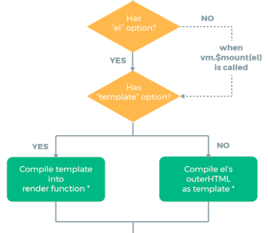
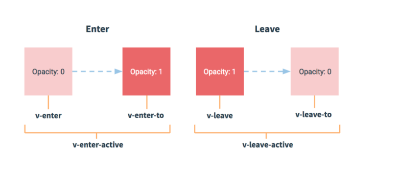

# Vue.js

## 简介

渐进式Js框架

### react


## 特点

1. 遵循MVVM模式
2. 代码简洁，体积小，效率高
3. 可引入插件和第三方库


## 创建Vue项目

1. 引入Vue.js

2. new一个Vue对象

    ```js
    const vm = new Vue({  //配置对象
    	el:'#app',  //element :选择器
      data:{    //数据（model）
      	message : 'Vue'
            },
      methods:{
      
    }
    })
    ```

    el：指定根element（选择器），这个new的Vue要控制的区域

    data：数据，

    在vm内部想互相访问属性，需要用this

3. 显示数据：`{{xxx}}`

    其中插值表达式还可以写为

    ```html
    <p v-text="message"></p>
    ```

    

4. 理解vue的mvvm实现

    1. id为app的div就是V，view

    2. new出来的vm对象，就是MVVM的vm调度者

    3. data就是M，model

        

导入包的时候，浏览器的内存中，就多了一个Vue构造函数


## v-cloak

可以解决插值表达式闪烁问题


## v-text

不用解决闪烁问题，但是不能随意加固定文字

例如：

```html
<p v-text="msg"></p>
```

会覆盖原本的内容

而插值表达式不会

v-text和插值表达式都不能插入html代码


## v-html

可插入html代码


## v-bind

vue中提供绑定属性的指令（单向绑定）

```html
<input type="button" v-bind:value="msg" >
<input type="button" v-bind:value="msg + 'vue'" >
```


简写：

不写v-bind，只写冒号

```html
<input type="button" :value="msg + 'vue'" >
```


## methods属性

methods属性中定义vue实例所有可用的方法

```js
const vm = new Vue({  //配置对象
	el:'#app',  //element :选择器
  data:{    //数据（model）
  	message : 'Vue'
        },
  methods:{
    show:function(){
      alert("hello vue")
    }
  }
})
```


## v-on绑定事件

例：

```html
<input type="button" :value="msg"  v-on:click="show">
```

简写为@click

其他事件：

click：点击

mouseover：鼠标覆盖


## 事件修饰符

### 阻止冒泡`.stop`

防止子元素触发父元素的事件

给子元素设置`@click.stop`

### 阻止默认行为`.prevent`

比如超链接跳转

### 捕获触发`.capture`

从外往里执行，给父元素添加	`capture`

### 元素本身触发时触发回调`.self`

给父元素添加`.self`，防止被冒泡

**注意**：

self只是被设定的那个不会被冒泡，如果有祖先元素，还是会冒泡

### 只触发一次`.once`

事件只执行一次

```html
<a href="http://www.baidu.com" @click.prevent.once="linkClick">有问题,先去百度</a>
```

例子只阻止一次


## v-model

双向数据绑定

可实现表单元素和Model的双向数据绑定

仅用于表单


## 绑定class类

```html
<p v-bind:class="['box1']"> 我是p </p>
```

需要使用v-bind做数据绑定

类名需要加引号

不写引号是变量

### 高级用法：

```html
<p v-bind:class="['box1',flag?'red':'']"> 我是p </p>
```

若flag为true执行red class ,false 执行空

flag存放在data

但写三元表达式可读性差。

另一种写法：对象形式

```html
<p v-bind:class=" [ 'box1' , { 'red' : flag } ] "> 我是p </p>
```


## 绑定style行内样式

```html
<h1 :style="{color:'red',fontSize:'222px'}">i am h1</h1>
<h1 :style="[blue]">i am h1</h1>
```


## v-for

语法：

`v-for="item in items"`

### 循环普通数组

```js
list:[0,1,2,3,4]
```

```html
<p v-for="(item,i) in list">第{{i+1}}个是{{item}}</p>
```


### 循环对象数组

```js
objArr:[
	{id: 1, name:'jayce'},
	{id: 2, name:'tony'}
]
```

```html
<p v-for="user in objArr">{{user.id}}----{{user.name}}</p>
```


### 循环对象
```js
obj:{
  id:1,
  name:"jayce",
  gender:'男'
}
```

```html
<p v-for="(val , key) in obj">{{val}}----{{key}}</p>
```


### 迭代数字

```html
<p v-for="count in 10">.</p>
```


v-for在组件中使用时，key是必须的

例如：

```html
<p v-for="item in list" :key="item.id">
	<input type="checkbox">{{item.id}}---{{item.name}}
</p>
```

注意: v-for 循环的时候，key 属性只能使用number获取string

注意: key 在使用的时候，必须使用v-bind 属性绑定的形式，指定key 的值

在组件中，使用v-for循环的时候，或者在一些特殊情况中，如果v-for 有问题，必须在使用v-for 的同时，指定唯一的字符串/数字类型:key值


## v-if和v-show

### v-if

每次都会重新删除和重新创建，切换性能消耗严重，频繁切换不建议

### v-show

每次设置display的属性值，初始渲染消耗大

asd


## 过滤器

用于常见文本格式化

可以用在两个地方：

1. mustache插值
2. v-bind表达式

### 全局过滤

**过滤器定义格式**

```js
Vue.filter('msgFormat',function (msg , arg) {
        return  msg.replace(/傻逼/g , arg);
    })
```

过滤器的函数中第一个参数已经被固定死了，永远都是过滤器管道符前面传递过来的数值.

第二个参数（arg）之后可以自定义参数。

调用：

```html
{{msg | msgFormat('**')}}
```

调用可以添加多个过滤器

### 私有过滤器

**过滤器定义格式**

在vm中添加属性：

```js
filters:{  //定于私有过滤器
   filterName:function (dataStr) {
                
     }
}
```

#### 调用顺序

就近原则，全局和私有名字可以一样，

就近调用

**字数填补方法：**

`padStart(x,"x")`

1.需要填补至几位

2.填补的字符


## 键盘操作

@keyup

### 按键修饰符

能操作的按键有：

`.enter`

`.tab`

`.delete`

`.esc`

`.space`

`.up`

`.down`

`.left`

`.right`	

没有上述的按键，则需要使用键盘码

比如：

`.enter` = 13

通过键盘码自定义名称：

2.X 版本：

```js
Vue.config.keyCodes.f2=113
```


## 自定义指令

### 钩子函数

指令函数提供

* `bind`：
    * 只调用一次
    * 指令第一次**绑定**到元素时调用。在这里可以进行一次性的初始化设置。
    * 常用于样式操作
* `inserted`：
    * 被绑定元素**插入**DOM时调用
    *  (仅保证父节点存在，但不一定已被插入文档中)。
    * 常用于JS行为
* `update`：
    * 所在组件的 VNode **更新**时调用，**但是可能发生在其子 VNode 更新之前**。
    * 指令的值可能发生了改变，也可能没有，可能触发多次

例如：

```js
inserted: function (el){
	el.focus()
}
```

每个函数中第一个参数永远是el，表示被绑定了指令的元素

el参数是原生的JS对象

第二个参数：`binding`

* 属性
    * `name`：指令名，不包括 `v-` 前缀。
    * `value`：指令的绑定值，例如：`v-my-directive="1 + 1"` 中，绑定值为 `2`。
    * `oldValue`：指令绑定的前一个值，仅在 `update` 和 `componentUpdated` 钩子中可用。无论值是否改变都可用。

### 全局自定义指令

```js
Vue.directive('focus' ,{
	inserted: function (el) {
    el.focus()
  }
})
//等同于，id为搜索框id
//document.getElementById("search").focus()
```

参数：

1. 指令名称，定义时不需要加v-前缀，调用时需要加
2. 一个对象，有指令相关的函数


### 私有指令

在vm中创建一个私有指令ß

```js
directives:{
	'fontweight':{
			bind:function (el , binding) {
				el.style.fontWeight = binding.value
		}
	}
}
```


## 生命周期


（来自：https://cn.vuejs.org/v2/guide/instance.html#%E7%94%9F%E5%91%BD%E5%91%A8%E6%9C%9F%E5%9B%BE%E7%A4%BA）

生命周期钩子 = 生命周期函数 = 生命周期事件

### new Vue

创建一个vm

```
var vm = new Vue({})
```


### 初始化事件和生命周期

表示刚初始化了一个Vue空实例对象，这个对象只有默认的一些**生命周期函数**和**默认事件**，其他东西都未创建

在1.`beforeCreate`生命周期函数执行时，data 和 methods未初始化


2.`created()` 第二个生命周期函数

这时data和methods已经创建完成


### 编辑模版




把Vue代码中的那些指令进行执行。

最终在内存中生成一个编译好的最终模版字符串

然后。把这个模板字符串渲染为内存中的DOM

此时。只是在内存中渲染好了模版。

并没有把模版挂载到真正的页面中去。

3.`beforeMount()`,页面元素还未被替换


### 替换页面


4.`mounted()` 

此时实例以及完全被建好了

就可以看到渲染好的页面了

这个实例会一直在内存中


## 发AJAX

利用vue-resource 实现get，post，jsonp 请求

`vue-resource` 是一个外部包

导入：

```html
<script src="https://cdn.jsdelivr.net/npm/vue-resource@1.5.2"></script>
```

[http参考手册](https://github.com/pagekit/vue-resource/blob/develop/docs/http.md)

### 发起get请求


语法：

```js
this.$http.get('/someUrl', [config]).then(successCallback, errorCallback);
```

失败回调可不传，成功必须传


### 发起post

语法：

```js
this.$http.post('/someUrl', [body], [config]).then(successCallback, errorCallback);
```


手动发起的post请求，默认没有表单格式，有的服务器处理不了

post方法的第三个参数，{emulateJSON: true}


## Vue动画

### 过度动画



**方法**：

1. 使用`transition` 把需要控制的元素包裹起来

`transition`是vue官方提供的元素

2. 自定义两组style样式，控制`transition`的元素

    其中style样式里主要包含图中的状态

    ```css
    /*动画进去之前和离开之后*/
    .v-enter,
    .v-leave-to{
    	opacity: 0;
    }
    /*入场动画和离场动画时间段*/
    .v-enter-active,
    .v-leave-active{
    	transition: all 0.4s ease;
    }
    ```

    

3. 对于这些在过渡中切换的类名来说，如果你使用一个没有名字的 `<transition>`，则 `v-` 是这些类名的默认前缀。

    如果你使用了 `<transition name="my-transition">`，那么 `v-enter` 会替换为 `my-transition-enter`。


### 第三方CSS

`animate.css`

[官网](https://animate.style/)

使用方法：

```html
<transition
	enter-active-class="animate__bounceIn"   
	leave-active-class="animate__bounceOut"
	:duration="{enter:400,leave:400}">
	<h1 v-if="flag" class="animate__animated">v-if</h1>
</transition>
```

`enter-active-class`入场动画

`leave-active-class`离场动画

`:duration`可以分别设置动画时间


### JS钩子函数

```html
<transition
  v-on:before-enter="beforeEnter"
  v-on:enter="enter"
  v-on:after-enter="afterEnter"
  v-on:enter-cancelled="enterCancelled"

  v-on:before-leave="beforeLeave"
  v-on:leave="leave"
  v-on:after-leave="afterLeave"
  v-on:leave-cancelled="leaveCancelled">
</transition>
```

使用方法：

```vue
methods : {
	beforeEnter(el){},
	enter(el,done){
    done()
  },
	afterEnter(el){}
}
```

每个函数身上都有一个el属性，表示要执行动画的那个DOM元素

1. `beforeEnter`表示动画入场之前，此时，动画尚未开始，此函数可设置起始样式

2. `enter` 表示动画开始的样式，可设置完成动画的结束状态

    其中在 `enter` 和 `leave` 中必须使用 `done` 进行**回调**

    这里的done，就是afterEnter这个函数，就是说done是afterenter的引用

    

3. `afterEnter` 动画完成后调用


Vue把一个完整的动画，使用钩子函数，拆分为了两部分

我们使用`flag` 标识符来，表示动画的切换 


### 列表动画

与前面不同的是

如果使用过度元素，是通过v-for渲染出来的，不能使用`transition`来包裹

需要使用`transition-group`

`transition-group`的`tag`和`appear`属性

appear实现页面入场动画

tag属性指定渲染元素，默认为span标签


## 组件化和模块化

### 组件化

组件，为了拆分Vue实例代码，能用不同的组件划分不同的功能模块

#### 创建公有组件

1.1 使用Vue.extend来创建全局的Vue组件。

返回一个 模版对象


```js
var com1 = Vue.extend({
	template: '<h3>i am h3</h3>'    
})
```

通过template属性，指定了组件要展示的HTML结构

1.2 使用Vue.component('组件的名称'，创建出来的组件模版对象)

注册组件

```js
Vue.component('mycom1', com1)
```

1.3 在HTML页面中使用组件

```html
<my-com1></my-com1>
```

**注意：注册可以使用驼峰命名法，但在在使用组件时必须使用`-`重新使用。**


**2. 简写：**

```
Vue.component('mycom2', {
	template: '<h3>i am h3</h3>'    
})

```


**注意⚠️：**

模版内容，组件必须包含在唯一的根元素中，可以写在一个div 中，但不能有两个同级的

3. template模版使用id

    在被控制的`#app`元素外面使用template元素，定义HTML模版结构

    ```js
    Vue.component('mycom3',{
    	template: '#tmp1'
    })
    ```

    ```html
    <template id="tmp1">
        <div>
            <h1>我是tmp1的模版</h1>
            <h1>i am mycom3</h1>
        </div>
    </template>
    ```

    template组件里放需要的内容


#### 定义私有组件

使用components定义内部私有组件

```js
const vm2 = new Vue({
	el : "#app2",
	components:{
		myPrcom:{
			template: '<h1>这是私有的login组件</h1>'
		}
	}
})
```

template也可以单独写在外面，使用id作为标记，同上


### 组件的data

component里直接使用data会报错

组件中的data，必须是一个方法

实例中的data可以是一个对象

组件中的data必须返回一个对象


### 组件切换

#### 方法一

使用`v-if`和`v-else`切换组件

在不同的组件使用定义的flag来切换

```html
<!--flag=true-->
<a href="" @click.prevent="flag = true">登陆</a>
 <a href="" @click.prevent="flag = false">注册</a>
<login v-if="flag"></login>
<register v-else="flag"></register>
```

```js
Vue.component('login',{
  template: '<h3>登陆</h3>'
})
Vue.component('register',{
  template: '<h3>注册</h3>'
})
```


#### 方法二

使用Vue提供的``component`组件展示对应名称的组件

```html
<component :is="'组件名'"></component>
```

需要注意的是：

​	组件名是字符串形式，必须使用引号

​	也可以使用变量：

```html
<a href=""  @click.prevent="comName='login'">登陆</a>
<a href=""  @click.prevent="comName='register'">注册</a>
```

需要定义：

comName : ' '


#### 组件切换动画

将`component`包含在`transition`里

```html
<transition mode="out-in">
	<component :is="comName"></component>
</transition>
```

使用`mode="out-in"`将动画设置为前一个淡出后后一个进入


动画设置：

```css
.v-enter,
.v-leave-to{
	opacity: 0;
	transform: translateY(50px);
}
.v-enter-active,
.v-leave-active{
	transition: all 0.5s ease;
}
```


#### 父子组件传值

父组件在引入子组件时，通过属性绑定（v-bind）把数据以数据绑定的形式，传递给子组件

使用方法：

1. 在使用组件的地方设置数据绑定

    ```html
    <com1 v-bind:parentmsg="msg"></com1>
    ```

2. 在组件定义时添加绑定

    ```js
    com1: {
    	template: '<h1>我是子组件--{{ parentmsg }}</h1>',
    }
    ```

3. 在组件定义地方添加`props`数组，定义才能使用

    ```js
    com1: {
    	template: '<h1>我是子组件--{{ parentmsg }}</h1>',
    	props: ['parentmsg']
    }
    ```

    所有props中的数据，都是通过父组件传递给子组件的

4. 子组件数据

    ```js
    data(){
    	return{
    		msg: 'child'
    	}
    },
    ```

    子组件数据可读可写

    父组件数据可读


#### 父组件方法传递

使用v-on


组件化和模块化的区别

组件化：从UI界面角度划分，前端组件化，方便UI组件重用

模块化：从代码逻辑角度划分，方便代码分层开发


